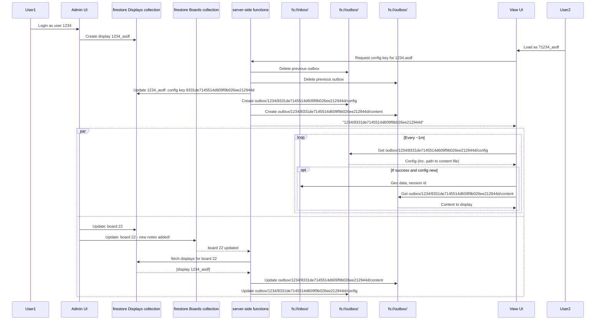

# pasteboard-jojo

## Rough sketch

```mermaid
sequenceDiagram
    participant User1
    participant Admin as Admin UI
    participant DD as firestore Displays collection
    participant BD as firestore Boards collection
    participant F as server-side functions
    participant SI1 as fs://inbox/
    participant SO1 as fs://outbox/
    participant SO2 as fs://outbox/
    participant V as View UI
    participant User2
    
    User1->>Admin: Login as user 1234
    Admin->>DD: Create display 1234_asdf
    
    User2->>V: Load as ?1234_asdf
    V->>F: Request config key for 1234.asdf
    F->>SO1: Delete previous outbox
    F->>SO2: Delete previous outbox
    F->>DD: Update 1234_asdf: config key 8331de7145514d609f9b026ee212944d
    F->>SO1: Create outbox/1234/8331de7145514d609f9b026ee212944d/config
    F->>SO2: Create outbox/1234/8331de7145514d609f9b026ee212944d/content
    F-->>V: "1234/8331de7145514d609f9b026ee212944d"
    par
        loop Every ~1m
            
            V->>SO1: Get outbox/1234/8331de7145514d609f9b026ee212944d/config
            SO1-->>V: Config (inc. path to content file)            
            opt If success and config new

                V->>SI1: Geo data, session id            
                V->>SO2: Get outbox/1234/8331de7145514d609f9b026ee212944d/content
                SO2-->>V: Content to display

            end
            
        end
    and
        Admin->>DD: Update: board 22
        Admin->>BD: Update: board 22 - new notes added!
        BD-->>F: board 22 updated
        F->>DD: fetch displays for board 22
        DD-->>F: [display 1234_asdf]        
        F->>SO2: Update outbox/1234/8331de7145514d609f9b026ee212944d/content
        F->>SO1: Update outbox/1234/8331de7145514d609f9b026ee212944d/config
    end    
```
